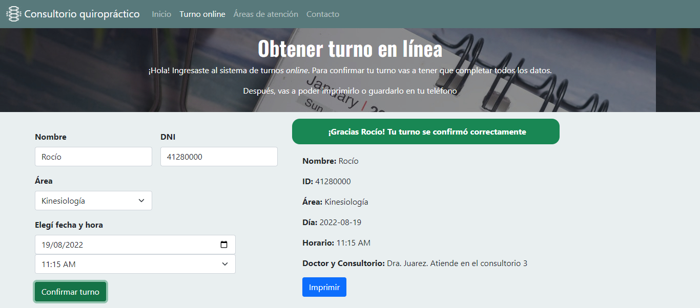

<!-- PROJECT LOGO -->
 

  

<h3 align="center">Appointment site</h3>

  

    Appointment site with responsive design built with JavaScript.
     
    <a href="https://rociogirardini.github.io/turnero/">View Demo</a>
     
    <a href="https://github.com/rociogirardini/"><strong>Explore other projects »</strong></a>
     
     
  

<!-- TABLE OF CONTENTS -->

  
Table of Contents

  <ol>
    <li>
      <a href="#about-the-project">About The Project</a>
      <ul>
        <li><a href="#built-with">Built With</a></li>
        <li><a href="#status">Status</a></li>
      </ul>
    </li>
    <li><a href="#contact">Contact</a></li>
  </ol>

<!-- ABOUT THE PROJECT -->
## About The Project

### Built With

* HTML5
* CSS3
* JavaScript

### Status

Complete.

<!-- CONTACT -->
## Contact

Rocío de los Milagros Girardini - [@Linkedin](https://www.linkedin.com/in/rocio-girardini/) - rogirardini@gmail.com

Project Link: [https://rociogirardini.github.io/turnero/](https://rociogirardini.github.io/turnero/)
 
Repository Link: [https://github.com/rociogirardini/turnero](https://github.com/rociogirardini/turnero)

(<a href="#top">back to top</a>)

